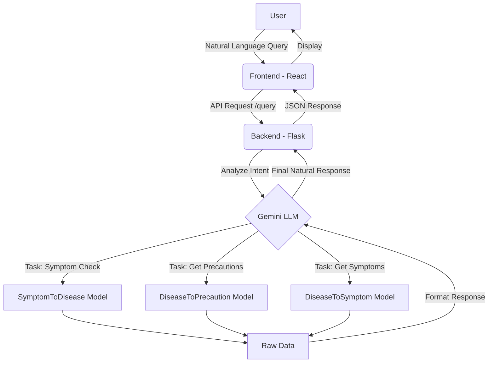

# HealthMate AI - Project Documentation

## 📋 Project Overview
**HealthMate AI** is a privacy-preserving, intelligent health assistant designed to provide users with accurate health information. It leverages advanced Large Language Models (LLMs) and specialized internal models to interpret natural language queries about symptoms, diseases, and precautions.

The system is built to be a reliable first point of reference for health-related questions, offering a seamless user experience through a modern web interface and a robust, scalable backend.

---

## 🏗️ System Architecture & Components

The project follows a modern microservices-like architecture, separating the frontend, backend, and database layers for scalability and maintainability.

### 1. Frontend (Client Side)
- **Framework**: React 18
- **Build Tool**: Vite (for fast development and optimized builds)
- **Styling**: Tailwind CSS (Utility-first CSS framework)
- **Icons**: Lucide React & Heroicons
- **PWA Support**: `vite-plugin-pwa` (Installable as a Progressive Web App)
- **Deployment**: Vercel
- **Key Features**:
  - Responsive, mobile-first design.
  - Real-time chat interface.
  - Secure authentication flows.
  - Fast performance and offline capabilities (PWA).

### 2. Backend (Server Side)
- **Framework**: Flask (Python)
- **AI Engine**: Google Gemini (via `google-generativeai`)
- **Data Processing**: Pandas, NumPy, Scikit-learn
- **Authentication**: JWT (JSON Web Tokens) & Bcrypt
- **Deployment**: Google Cloud Run (Containerized with Docker)
- **Key Responsibilities**:
  - **Intent Recognition**: Uses Gemini LLM to understand if a user is asking about symptoms, diseases, or precautions.
  - **Model Routing**: Directs queries to the appropriate internal model (`SymptomToDisease`, `DiseaseToPrecaution`, etc.).
  - **Response Formatting**: Synthesizes raw data into human-readable, empathetic responses using LLM.
  - **API Management**: Exposes RESTful endpoints for the frontend.

### 3. Database
- **Technology**: MongoDB (NoSQL)
- **Hosting**: MongoDB Atlas (Cloud-managed)
- **Usage**:
  - Storing user profiles and authentication credentials securely.
  - Managing chat history (privacy-preserving implementation).
  - Storing disease and symptom datasets for quick retrieval.

---

## 🚀 Key Features & Uses

HealthMate AI serves as a comprehensive health companion with the following capabilities:

### 1. Intelligent Symptom Checker
- **Input**: Users describe their symptoms in natural language (e.g., "I have a splitting headache and nausea").
- **Process**: The system extracts symptoms and runs them through a predictive model.
- **Output**: Potential conditions are identified with associated probabilities, helping users understand what might be wrong.

### 2. Disease Information & Precautions
- **Input**: Users ask about specific diseases (e.g., "How do I prevent Dengue?" or "Symptoms of Malaria").
- **Process**: The system retrieves verified data from its internal datasets.
- **Output**: Detailed lists of symptoms, transmission modes, and preventative measures.

### 3. Natural Language Interaction
- Unlike rigid medical search engines, HealthMate AI understands context and nuance, allowing users to ask follow-up questions and receive conversational answers.

### 4. Privacy-First Design
- User data is handled with strict security measures.
- Authentication ensures that personal health queries remain private.

---

## 📐 Software Design & Data Flow

The application follows a **Retrieval-Augmented Generation (RAG)** inspired pattern where the LLM acts as a controller for specialized data tools.

### Data Flow Diagram

### Design Patterns
- **Controller-Service Pattern**: The Flask routes act as controllers, delegating logic to specialized model classes (Services).
- **Factory Pattern**: Used in initializing and loading different models (`symptom_model`, `precaution_model`) efficiently.
- **Decorator Pattern**: Used for the `@token_required` authentication middleware to secure routes.

---

## 🛠️ Deployment Stack

| Component | Technology | Hosting Platform |
|-----------|------------|------------------|
| **Frontend** | React + Vite | **Vercel** |
| **Backend** | Flask + Python | **Google Cloud Run** |
| **Database** | MongoDB | **MongoDB Atlas** |
| **AI Model** | Gemini Pro | **Google AI Studio** |

---

## 🔮 Future Roadmap
- **Voice Interface**: Enabling voice-to-text for easier accessibility.
- **Multi-language Support**: Breaking language barriers for global accessibility.
- **Doctor Connect**: Optional feature to share reports with healthcare professionals.
- **Offline Mode**: Enhanced local caching for critical health info without internet.

access our presentation here : [clickme](https://www.canva.com/design/DAG2ueEtI4o/xvw7F8U4n_rboa6NbxQgRA/edit?utm_content=DAG2ueEtI4o&utm_campaign=designshare&utm_medium=link2&utm_source=sharebutton)

access our demo Video here : [clickme](https://drive.google.com/file/d/1IA7Zqk2VDdiOukFWqeLpSAaMXxakU0kY/view)
