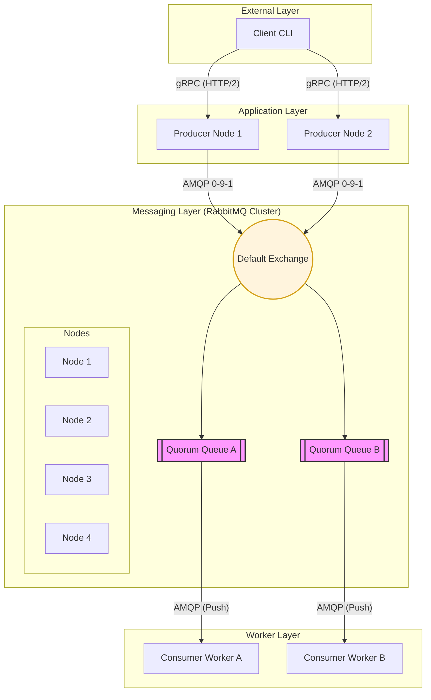
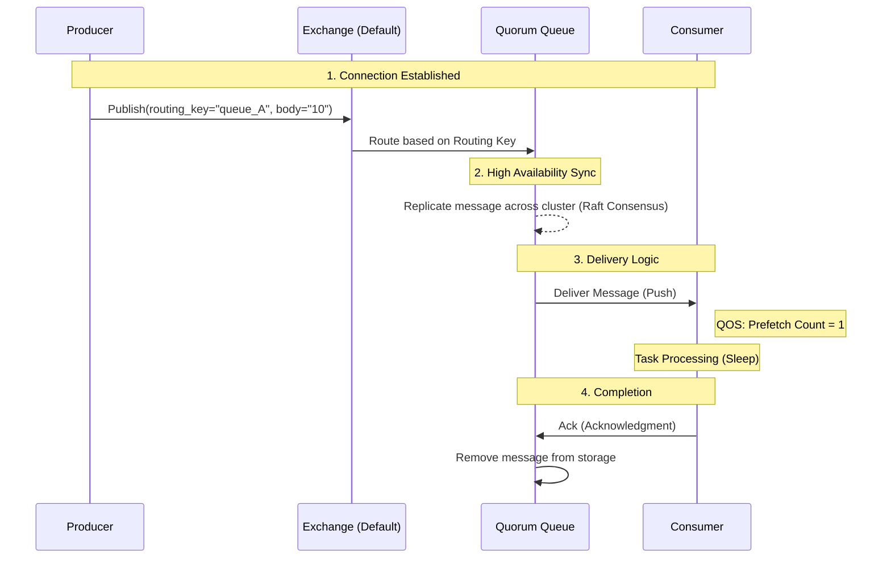

# Distributed Messaging Queue using RabbitMQ 🐰🚀

A highly available, distributed task processing system built with **Go**, **RabbitMQ**, and **gRPC**. This project demonstrates a robust architecture for handling asynchronous tasks with guaranteed delivery, fault tolerance, and load balancing.


---

## 🏗️ System Architecture

The system consists of four primary components interacting via high-performance protocols.



---

## 🧩 Core Components

### 1. The Client 🖥️
- **Role**: The entry point for users to submit tasks.
- **Functionality**:
    - Takes user input (e.g., `classA 10`).
    - Performs **Client-side Load Balancing** by randomly picking an available Producer node.
    - Communicates with Producers using **gRPC**.

### 2. The Producer 🛠️
- **Role**: Acts as a gateway between the gRPC interface and the RabbitMQ broker.
- **Functionality**:
    - Receives tasks via gRPC.
    - Implements **Routing Logic**:
        - `classA` -> Routes to `queue_A`.
        - `classB` -> Routes to `queue_B`.
        - `classAB` -> Fan-out style; duplicates message to **both** `queue_A` and `queue_B`.
    - Publishes messages to RabbitMQ using **AMQP**.

### 3. RabbitMQ Cluster ☁️
- **Role**: The backbone of the system, responsible for message storage, routing, and reliability.
- **Structure**: A 4-node cluster ensuring no single point of failure. If one node goes down, the cluster continues to operate.
- **Cluster Formation**: Uses a shared **Erlang Cookie** for node authentication and `rabbitmq.conf` for automatic discovery via DNS/Hostnames in the Docker network.

### 4. The Consumer (Worker) 👷
- **Role**: Processes the actual tasks.
- **Functionality**:
    - Subscribes to a specific queue.
    - Simulates work by "sleeping" for the duration specified in the message.
    - Uses **Manual Acknowledgments** to ensure a task is never lost if a worker crashes during execution.

---

## 📥 Inside RabbitMQ: The Deep Dive

### 🔄 Message Flow Exactly


### 🗝️ Key RabbitMQ Concepts Used

| Component | Explanation |
| :--- | :--- |
| **Exchange** | The "Mail Room". We use the **Default Exchange** (Direct), which automatically routes messages to the queue that matches the `routing_key`. |
| **Quorum Queues** | Modern, replicated queues based on the **Raft consensus algorithm**. Unlike classic queues, they prioritize data safety and are designed for high availability. |
| **QoS (Quality of Service)** | We set `Prefetch Count = 1`. This ensures RabbitMQ doesn't "overload" a worker. It only sends one message at a time, waiting for an `Ack` before sending the next. |
| **Persistence** | Messages are marked as `Persistent` and queues are `Durable`. This means even if the entire RabbitMQ cluster restarts, the tasks are not lost. |

---

## 📡 Protocols Used

### **gRPC (Google Remote Procedure Call)**
- **Where**: Client ↔️ Producer.
- **Why**: 
    - **Performance**: Uses HTTP/2 and Protocol Buffers (binary format) which is much faster than JSON/HTTP/1.1.
    - **Strict Contract**: The `.proto` file ensures both sides agree on the data structure.

### **AMQP 0-9-1 (Advanced Message Queuing Protocol)**
- **Where**: Producer/Consumer ↔️ RabbitMQ.
- **Why**: 
    - **Robustness**: Provides features like Heartbeats (to detect dead connections) and Acknowledgments.
    - **Flexibility**: Supports complex routing patterns and queue configurations.

---

## 🚀 How to Run

### Quick Start with Makefile
If you have `make` installed, you can use the following commands:
```bash
# Spin up infrastructure
make up

# Build binaries
make build

# Generate proto code (optional)
make proto
```

### Manual Steps
- make sure that you already have Go, DockerCompose on your laptop
#### Step 1: Spin up the Infrastructure
```bash
docker-compose up -d
```
*Wait ~30 seconds for the cluster to form. Access the dashboard at `http://localhost:15672` (guest/guest).*
- if that doesn't work, manually pull the rabbitmq image and try again
```bash
docker pull rabbitmq:3.13-management
docker-compose up -d
```

#### Step 2: Start Producers
```bash
go run producer/main.go -port 50051
go run producer/main.go -port 50052
```

#### Step 3: Start Consumers
```bash
go run consumer/main.go -queue queue_A
go run consumer/main.go -queue queue_B
```

#### Step 4: Run the Client
```bash
go run client/main.go
```

---

## 🗺️ Roadmap (Next Steps)
To take this project to a professional production level, the following features are planned:
- [ ] **Observability**: Prometheus metrics, Grafana dashboards, and OpenTelemetry tracing.
- [ ] **Reliability**: Dead Letter Queues (DLQ) and exponential backoff retries.
- [ ] **DevOps**: CI/CD pipelines via GitHub Actions and Kubernetes deployment manifests.
- [ ] **Advanced Patterns**: Consumer idempotency and message priority handling.

*Track progress in [GitHub Issues](https://github.com/JabadeSusheelKrishna/Distributed-Messaging-Queue-using-RabbitMQ/issues).*

---

## 🛠️ Tech Stack
- **Language**: Go (Golang)
- **Messaging**: RabbitMQ (Quorum Queues)
- **Communication**: gRPC, AMQP 0-9-1
- **Deployment**: Docker, Docker Compose

---
*Developed by Susheel Krishna, Vishnu Sai Reddy, Jakeer Hussain* 🚀